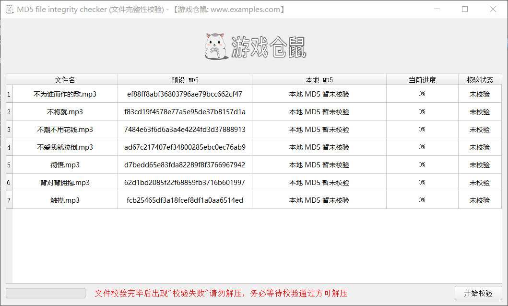
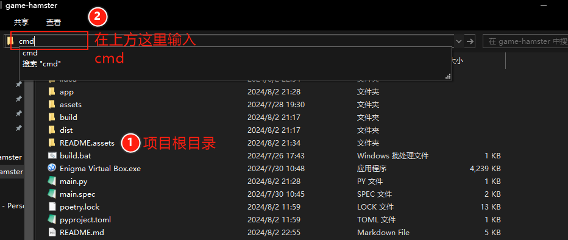

##  游戏仓鼠（MD5 文件批量校验工具）

## 项目框架

> 本项目仅使用 `PySide2` 框架进行开发

## 使用方法

### 普通用户

1. 双击直接进入软件

2. 点击`开始校验`（如果校验失败，请以管理员身份启动软件）

   

### 打包人员

> 前提是：已经搭建好开发环境，否则下述所有操作一样无法完成，GUI 界面依赖于其他包，因此打包必须有开发环境。

1. **预设自动化脚本直接使用**

   项目中已经预设好一个自动化脚本 `demo/auto.py`，是否方式如下：

   ```bash
   # 务必保证 auto.py 在待打包目录的上一级中，结构如下即可：
   - 工作目录
   	- 游戏文件目录1
   		- xx1.rar
   		- xx2.rar
   		- ...
   	- 游戏文件目录2
   	- ...
   	- auto.py
   ```

   `auto.py` 你可以修改一些你能修改的东西（也可以不修改，里面能修改的有：打包后的程序名）。

   务必记得将 `auto.py` 复制到工作目录中（工作目录是指包含若干个游戏文件目录的文件夹）。

   最后在工作目录中打开 cmd 运行以下命令，会在各个游戏目录中生成程序。

   ```bash
   python auto.py <拖入项目文件夹中的 bat 文件>
   ```

2. **自定义自动化脚本**

   项目文件夹中存在一个 `build.bat` 文件，用于打包单个应用，该文件对外提供命令行接口：

   ```bash
   build.bat <json文件> <输出目录> <是否结尾暂停[yes/no]> <程序名称>
   ```

   json 文件格式：

   ```json
   {
       "presets": [
           {
               "filename": "xx1.rar",
               "data_md5": "xxxxxxxxxxxxxxxxxxxx",
           },
           ...
       ]
   }
   ```

   例子：

   ```bash
   build.bat E:\\presets.json E:\\output no 游戏仓鼠校验工具
   ```

   由于框架的原因，打包是基于 `pyinstaller` 进行分发程序，打包内部实现也只是靠文件内容的复制然后调用 `pyinstaller` 打包成单个文件，本身是没有这种嵌入 json 文件格式的打包。所以，这个过程是不能进行多线程或者多进程并发打包的，否则十分容易产生配置文件竞争的现象。

   自定义脚本的思路这边简单提供一下：

   ```
   单个目录 -> 遍历其中文件并计算md5 -> 生成json
   -> 调用上述 bat 文件(build.bat json文件的绝对路径 输出目录的绝对路径 no 应用名称)
   
   多个目录循环遍历即可（切忌不要使用多线程或者多进程，除非有更高的能力这样做）
   ```

   具体需要自己实现，可以参考 `auto.py`，或者联系我定制。

## 开发部署

1. 安装 Python 3.7.2 32 位（因为最低支持 win7 32 位电脑）

2. 安装 Pycharm
   
3. 保证安装了 python 的情况下，安装 poetry（项目依赖管理），在 cmd 中运行：

   ```bash
   pip install poetry -i https://mirrors.tencent.com/pypi/simple
   ```

4. 然后安装项目依赖的框架，在图示标记位置，输入 cmd，然后回车：

   

5. 在该文件夹下打开 cmd 后，键入以下命令：

   ```bash
   poetry lock
   ```

   执行完后，还需要执行另外下方命令：

   ```bash
   poetry install
   ```

默默等待安装完成后，开发环境安装完毕，可以使用 pycharm 打开这个项目进行二次开发以及打包的接口都是可用的。

### 视频教程

开发环境以及打包分别已经录制了短视频，几十秒到两三分钟的时间。

打包视频可以不用看，环境搭建视频可以了解一下，十分简单，需要远程搭建请联系客服人员告知。

Bilibili 视频：[https://www.bilibili.com/opus/961349689598279703](https://www.bilibili.com/opus/961349689598279703)

如果 b 站视频已经和谐，请查看以下百度网盘视频链接：

链接: https://pan.baidu.com/s/1srtTEWYASogwix5TPCl0yg?pwd=2024   提取码: 2024 

### 运行Demo

假设你是打包人员，同时你的开发环境已经部署完毕，请进入 `项目文件夹/demo/` 目录中，路径框中输入 cmd，进入命令行。

运行以下命令：

```bash
python auto.py <回到项目文件夹中，将 build.bat 文件拖入到命令就会自动添加路径了>
```

如果你的电脑上有多个 Python 版本，我们需要兼容 Windows7 x32位的电脑，那么你可以使用下方命令：

```bash
py -3.7 auto.py <拖入 build.bat 文件>
```

上方两者是等效的。接下来你去 `demo` 目录下方的四个文件夹中运行生成的 `exe` 可执行文件进行 MD5 校验即可。

## 代码配置

### 配置文件

位于：`app/bases/config.py` 文件中

可选更改（打包生效）：

- 任务栏、窗口上、程序的应用图标*(请使用同名替换文件，不要修改路径，否则build.bat也得修改路径，名字：icon.ico)*
- 应用标题栏显示的名称
- 广告区域点击后跳转的网址
- 广告 LOGO 图片的路径*(请使用同名替换方法，不要修改路径，否则build.bat也得修改路径，名字：logo.png)*
- 左侧底部文字提示信息
- 左侧底部文字点击后跳转的网址(前提是配置了该网址，如果是空字符串则不能点击)
- 校验状态的显示的文字内容及其文字颜色

### UI 文件

1 条预设的信息包含：

- 文件名称（仅用于展示，校验时在当前目录查找）
- 文件内容的 MD5（配置人员设置时自动计算的 MD5）

项目中有  `main_window` 主窗口的代码文件，目录包含 `task.py`（负责逻辑、表格模型等）、`view.py`（由 ui 文件转换的 py 代码，相当于是个底板）、`ui.py`（引入 view.py 文件真实的界面文件，负责各种渲染和点击事件），你可能看到由 `view.ui` 这样的文件，它是 QT 设计工具产生的代码，你可以使用 Qt 官方的设计工具打开，自行设计界面，然后通过 `pyuic` 脚本将该文件转为 `view.py` 文件，就能在原有的界面基础上实现自定义了。